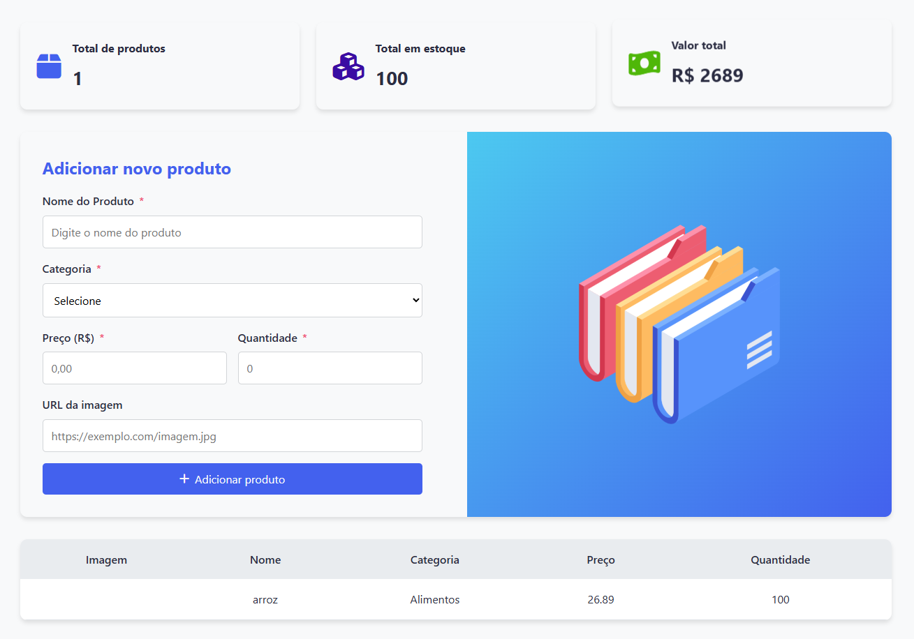

# Invent Store

<!--

-->

> Este projeto foi desenvolvido durante o curso de Análise e Desenvolvimento de Sistemas, o principal foco é realizar de maneira simples operações de CRUD no local storage do navegador, utilizando objetos em formato JSON para isso.

### [Link do projeto](https://) - **! Projeto em manutenção !**

### Ajustes e melhorias

O projeto ainda está em desenvolvimento e as próximas atualizações serão voltadas para as seguintes tarefas:

- [x] Cadastro de produtos
- [x] Validação de conteúdo nos inputs
- [x] Tratamento simples de texto
- [x] Notificações
- [x] Visualização de objetos cadastrados
- [x] Refresh automático a cada nova adição
- [ ] Alteração de dados nos objetos do local storage
- [ ] Exclusão de objetos do local storage
- [ ] Adição de imagens
- [ ] Responsividade

## ⚙ Tecnologias usadas

O projeto atualmente conta com as seguintes tecnologias:
- HTML
- CSS
- Javascript

<!--
## 📫 Contribuição para o Invent Store
Para contribuir com o projeto, siga estas etapas:

1. Dê um fork neste repositório.
2. Crie um branch: git checkout -b **nome_branch**.
3. Faça suas alterações e confirme-as: git commit -m '**mensagem_commit**'
4. Envie para o branch original: git push origin **nome_do_projeto / local**
5. Crie a solicitação de pull.

Como alternativa, consulte a documentação do GitHub em [como criar uma solicitação pull](https://help.github.com/en/github/collaborating-with-issues-and-pull-requests/creating-a-pull-request).

## 💡 Funcionalidades do projeto
As principais funcionalidades do projeto até o momento são:
- **Validação de campos:** Verifica se os campos para adicionar os dados do produto estão vazios
- **Notificações personalizadas:** Assim que o usuário clica no botão de adicionar o produto, é retornada uma notificação de acordo com o estado de preenchimento dos campos.
- **Adição de dados em formato JSON:** Os dados digitados nos campos são enviados para um objeto JSON que em seguida é salvo no local storage do navegador usado, formatando os objetos e os unindo numa lista para visualização.
- **Atualização de dados no dashboard:** Os dados dos produtos cadastrados são tratados e adicionados ao dashboard conforme seu cadastro:
    - _**Quantidade total de produtos:**_ É alterada conforme cada novo cadastro realizado, adicionando 1 ao contador.
    - _**Quantidade total em estoque:**_ Atualiza a quantidade total de itens a cada produto cadastrado.
    - _**Valor total do estoque:**_ Atualiza o valor total primeiro multiplicando o valor unitário do produto por sua quantidade, e em seguida adiciona ao card esse valor.
    - _**Notificação de estoque baixo:**_ Caso não haja produtos cadastrados, é mostrado um card de aviso. -->
